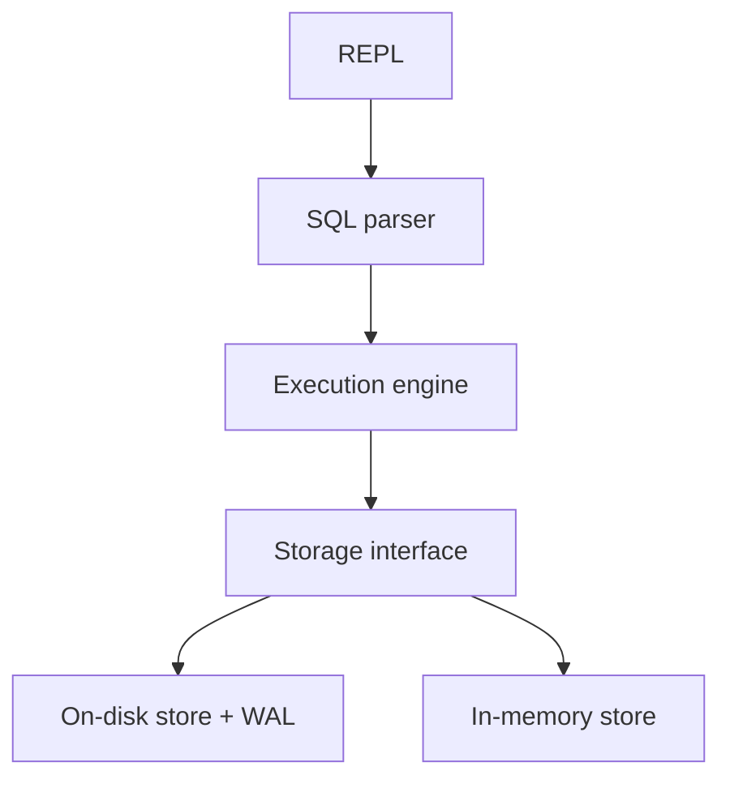

# GoDB

GoDB is a tiny educational database engine written in Go. It exists as a playground to explore storage internals, SQL parsing, and a minimal query engine with a growing on-disk story.

> ⚠️ This is a learning project, not production-ready software.

## Features

- Pluggable storage engines:
  - In-memory store for quick experimentation
  - Experimental on-disk filestore with a simple WAL (write-ahead log)
- Simple SQL support:
  - `CREATE TABLE`
  - `INSERT INTO ... VALUES (...)`
  - `SELECT * FROM table`
  - `SELECT col1, col2 FROM table`
  - `SELECT ... FROM table WHERE column <op> literal` with `=`, `!=`, `<`, `<=`, `>`, `>=`
  - `SELECT ... FROM table ORDER BY column [ASC|DESC]`
  - `SELECT ... FROM table LIMIT n`
  - `UPDATE table SET col = value WHERE column <op> literal`
  - `DELETE FROM table WHERE column <op> literal`
- REPL-style shell to run SQL commands
- Supported data types: `INT`, `FLOAT`, `STRING`, `BOOL` (plus `NULL` literals)
- Basic transactions: `BEGIN`, `COMMIT`, `ROLLBACK`

## Requirements

- [Go](https://go.dev/) 1.25+

## Getting started

```bash
# Clone and enter the project
git clone https://github.com/askorykh/godb.git
cd godb

# Run the REPL server (creates ./data when using the filestore)
go run ./cmd/godb-server
```

While in the REPL, try commands such as:

```sql
CREATE TABLE users (id INT, name STRING, active BOOL);
INSERT INTO users VALUES (1, 'Alice', true);
SELECT * FROM users;
BEGIN;
INSERT INTO users VALUES (2, 'Bob', false);
COMMIT;
```


### Storage backends

By default the REPL wires the engine to the on-disk filestore located in `./data`. It uses a straightforward file format and an append-only WAL for durability. On startup, the filestore replays committed WAL entries to rebuild table files. Rollbacks still only cancel the in-memory engine transaction—the on-disk table files are not reverted yet. See [`internal/storage/filestore/README.md`](internal/storage/filestore/README.md) for details.

If you want a pure in-memory experience (no files written), switch to the `memstore` engine inside `cmd/godb-server/main.go` by swapping the initialization block.

### Transactions

The engine understands `BEGIN`, `COMMIT`, and `ROLLBACK` to group multiple statements. Transactions are executed against the configured storage backend. With the default filestore backend, commits fsync the WAL before returning; rollbacks do not undo writes on disk yet, but committed WAL entries are replayed on startup.

## Running tests

```bash
go test ./...
```

## Project structure

```
cmd/
  godb-server/      # REPL entrypoint that wires the engine and storage
internal/
  engine/           # DB engine, execution planner, and simple evaluator
  sql/              # SQL parser and AST definitions
  storage/
    filestore/      # On-disk storage with WAL and recovery
    memstore/       # In-memory storage implementation
  index/
    btree/          # WIP B-tree index structures used by the filestore
```

## Architecture



- `cmd/godb-server` reads input, handles meta commands, and forwards SQL to the engine.
- `internal/sql` parses SQL into AST nodes and validates column types.
- `internal/engine` executes statements (create, insert, select, update, delete) against the storage implementation.
- `internal/storage/filestore` provides the default on-disk storage layer with WAL and recovery.
- `internal/storage/memstore` provides an in-memory table storage layer used for testing/experiments.

## Roadmap (very rough)

- Improve on-disk storage (rollback/undo, durability tests, compaction)
- Better query planner / optimizer
- Indexes integrated into query execution
- Richer SQL surface and multi-statement transaction semantics
- Maybe: distributed experiments later
