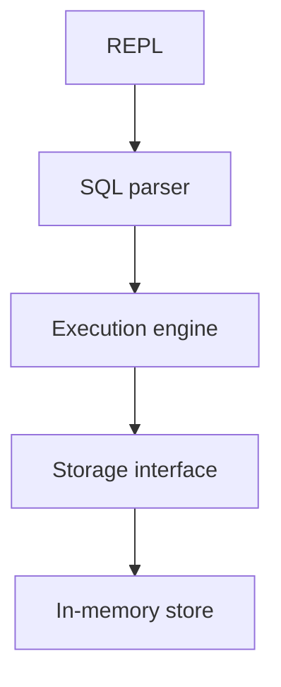

# GoDB

GoDB is a tiny educational database engine written in Go. It exists as a playground to explore storage internals, SQL parsing, and a minimal query engine with a growing on-disk story.

> ⚠️ This is a learning project, not production-ready software.

## Features

- In-memory storage engine for quick experimentation
- Simple SQL support:
  - `CREATE TABLE`
  - `INSERT INTO ... VALUES (...)`
  - `SELECT * FROM table`
  - `SELECT col1, col2 FROM table`
  - `SELECT ... FROM table WHERE column <op> literal` with `=`, `!=`, `<`, `<=`, `>`, `>=`
  - `SELECT ... FROM table ORDER BY column [ASC|DESC]`
  - `SELECT ... FROM table LIMIT n`
  - `UPDATE table SET col = value WHERE column <op> literal`
  - `DELETE FROM table WHERE column <op> literal`
- REPL-style shell to run SQL commands
- Supported data types: `INT`, `FLOAT`, `STRING`, `BOOL` (plus `NULL` literals)
- Basic transactions: `BEGIN`, `COMMIT`, `ROLLBACK`

## Requirements

- [Go](https://go.dev/) 1.25+

## Getting started

```bash
# Clone and enter the project
git clone https://github.com/askorykh/godb.git
cd godb

# Run the REPL server (in-memory storage)
go run ./cmd/godb-server
```

While in the REPL, try commands such as:

```sql
CREATE TABLE users (id INT, name STRING, active BOOL);
INSERT INTO users VALUES (1, 'Alice', true);
SELECT * FROM users;
BEGIN;
INSERT INTO users VALUES (2, 'Bob', false);
COMMIT;
```


### Storage backend

The REPL uses the in-memory storage engine to match the article walkthroughs and keep the footprint tiny.

### Transactions

The engine understands `BEGIN`, `COMMIT`, and `ROLLBACK` to group multiple statements. Transactions are executed against the configured storage backend. In the in-memory backend used for the articles, commit simply swaps the staged tables into place and rollback is a no-op.

## Running tests

```bash
go test ./...
```

## Project structure

```
cmd/
  godb-server/      # REPL entrypoint that wires the engine and storage
internal/
  engine/           # DB engine, execution planner, and simple evaluator
  sql/              # SQL parser and AST definitions
  storage/
    memstore/       # In-memory storage implementation
```

## Architecture


```mermaid
graph TD;
  REPL --> Parser[SQL parser];
  Parser --> Engine[Execution engine];
  Engine --> Storage[Storage interface];
  Storage --> Memstore[In-memory store];
```

- `cmd/godb-server` reads input, handles meta commands, and forwards SQL to the engine.
- `internal/sql` parses SQL into AST nodes and validates column types.
- `internal/engine` executes statements (create, insert, select, update, delete) against the storage implementation.
- `internal/storage/memstore` provides an in-memory table storage layer used for testing/experiments.
## Roadmap (very rough)

- Better query planner / optimizer
- Richer SQL surface and multi-statement transaction semantics
- Maybe: distributed experiments later
